### Sobre
Sou aluno da FIAP, dedicado e disciplinado, construindo base forte para atuar como desenvolvedor Full Stack. Meu foco é aprender do jeito que recrutador valoriza: fundamentos + projetos com qualidade (documentação, testes quando aplicável, e deploy).

### O que eu busco
Estágio ou vaga júnior onde eu possa evoluir com código real: front, back, banco de dados e boas práticas.

### Competências em desenvolvimento
- Web: HTML, CSS, JavaScript, HTTP/REST
- Versionamento: Git/GitHub (workflow, branches, PR)
- Base: lógica, estruturas, orientação a objetos (quando aplicável)
- Próximos passos: back-end consistente + banco + deploy + testes

### Projetos em destaque
- **Avaliador de Perfil GitHub (Front + Integração API)** — Analisa perfis do GitHub, gera pontuação técnica e feedback acionável com base em métricas de repositórios e atividade.  
  Repo: [LINK](https://github.com/wilamis-brasil/avaliador-perfil-github) Stack: HTML / CSS / JavaScript / GitHub REST API

- **LifeBlocks (Produtividade Web App)** — Aplicação de produtividade com organização de rotinas, tarefas e foco, interface responsiva e lógica de estado no cliente.  
  Repo: [LINK](https://github.com/wilamis-brasil/lifeblocks) Stack: HTML / CSS / JavaScript / PWA

### Formação
FIAP Análise e Desenvolvimento de Sistemas —  Graduação (em andamento)

### Contato
- LinkedIn: SEU_LINK
- Email: wilamisbrasil.preludio1@gmail.com
